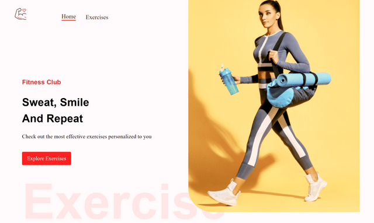
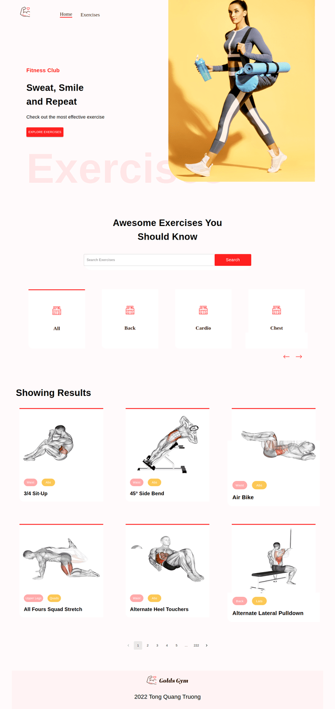
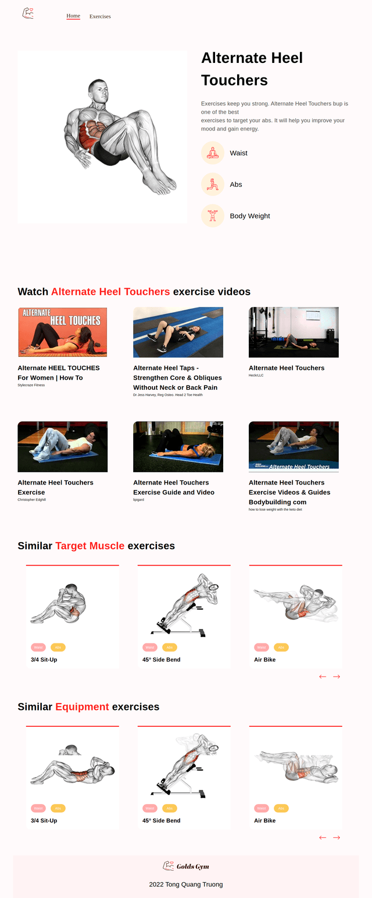

# React Fitness Application

A site you can search for exercises.

## Live Demo: https://truonggym.netlify.app/



## Features

- Search for exercises by name, target muscle, equipment.
- Dynamic routing.
- Each exercise has body part, target muscle, equipment, youtube videos and similar exercises.
- Responsive.

## Build With:

- React.
- MUI.
- React Router.
- Vite.
- Api from https://rapidapi.com/ .

## Run Locally

Clone the project

```bash
  git clone git@github.com:truongwerk/Fitness_Exercises.git
```

Install dependencies

```bash
  yarn install
```

Start the server

```bash
  yarn run dev
```

## License



##



[MIT](https://choosealicense.com/licenses/mit/)
